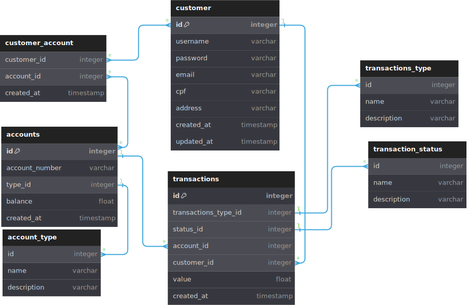

# Desafio - BTG Pactual Digital
## Descrição
Criação de uma API REST para um sistema de contas bancárias digitais simples.
## Tecnologias
Lista de tecnologias utilizadas para criação da API:
- Typescript
- Node.js
- Express
- Prisma
- PostgreSQL

## Organização do banco de dados
O banco de dados relacional escolhido foi o postgreSQL por ser um dos bancos de dados mais utilizados no mercado.

Os dados foram organizado em 7 tabelas, sendo 3 tabelas principais:
- **Customer**: Tabela que armazena os dados do cliente, como `nome, CPF, e-mail, senha, endereço, data de criação e data de atualização`.
- **Account**: Tabela que armazena os dados da conta bancária, como `número da conta, saldo, data de criação e tipo de conta (Corrente ou Poupança)`.
- **Transaction**: Tabela que armazena os dados das transações, como `valor, data de criação, tipo de transação (Depósito, Saque) e o ID da conta e do cliente que realizou a transação`.

1 tabela de relacionamento entre as tabelas Customer e Account:
- **Customer_Account**: Tabela que armazena o `ID do cliente e da conta bancária e data de criação`.

3 tabelas contendo dados estáticos para auxilio:
- **Account_Type**: Tabela que armazena os tipos de conta bancária, como `ID e nome do tipo de conta e descrição`.
- **Transaction_Type**: Tabela que armazena os tipos de transação, como `ID e nome do tipo de transação e descrição`.
- **Transaction_Status**: Tabela que armazena os status das transações, como `ID e nome do status da transação e descrição`.

### Cardinalidades e regras de negócio
- **Customer**: N:N com **Account**, assim criando a tabela **Customer_account** ( um cliente pode ter no máximo 2 contas, uma poupança e uma corrente. Essas contas podem ser compartilhadas com mais de 1 cliente).
- **Account**: 1:N com **Transaction** (uma conta pode ter várias transações).
- **Customer**: 1:N com **Transaction** (um cliente pode ter várias transações).
- **Account**: 1:N com **Account_Type** (uma conta só pode ter um tipo, mas podem existir várias contas do mesmo tipo).
- **Transaction**: 1:N com **Transaction_Type** (uma transação só pode ter um tipo, mas podem existir várias transações do mesmo tipo).
- **Transaction**: 1:N com **Transaction_Status** (uma transação só pode ter um status, mas podem existir várias transações do mesmo status).
### Modelo ER

### Modelo DER
