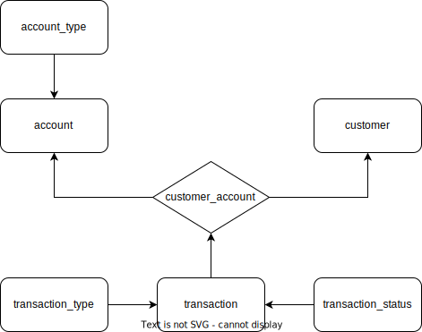

# Desafio - BTG Pactual Digital

# Sumário

- [Descrição](#descrição)
- [Tecnologias](#tecnologias)
- [Organização do banco de dados](#organização-do-banco-de-dados)
  - [Cardinalidades e regras de negócio](#cardinalidades-e-regras-de-negócio)
  - [Modelo ER](#modelo-ER)
  - [Modelo DER](#modelo-DER)
- [Como rodar o projeto](#como-rodar-o-projeto)
    - [Pré-requisitos](#pré-requisitos)
    - [Instalação](#instalação)
- [Rotas](#rotas)
    - [Customer](#customer)
    - [Account](#account)
    - [Transaction](#transaction)


## Descrição
Criação de uma API REST para um sistema de contas bancárias digitais simples.
## Tecnologias
Lista de tecnologias utilizadas para criação da API:
- Typescript
- Node.js
- Express
- Prisma
- PostgreSQL

## Organização do banco de dados
O banco de dados relacional escolhido foi o postgreSQL por ser um dos bancos de dados mais utilizados no mercado.

Os dados foram organizado em 7 tabelas, sendo 3 tabelas principais:
- **Customer**: Tabela que armazena os dados do cliente, como `nome, CPF, e-mail, senha, endereço, data de criação e data de atualização`.
- **Account**: Tabela que armazena os dados da conta bancária, como `número da conta, saldo, data de criação e tipo de conta (Corrente ou Poupança)`.
- **Transaction**: Tabela que armazena os dados das transações, como `valor, data de criação, tipo de transação (Depósito, Saque) e o ID da conta e do cliente que realizou a transação`.

1 tabela de relacionamento entre as tabelas Customer e Account:
- **Customer_Account**: Tabela que armazena o `ID do cliente e da conta bancária e data de criação`.

3 tabelas contendo dados estáticos para auxilio:
- **Account_Type**: Tabela que armazena os tipos de conta bancária, como `ID e nome do tipo de conta e descrição`.
- **Transaction_Type**: Tabela que armazena os tipos de transação, como `ID e nome do tipo de transação e descrição`.
- **Transaction_Status**: Tabela que armazena os status das transações, como `ID e nome do status da transação e descrição`.

### Cardinalidades e regras de negócio
- **Customer**: N:N com **Account**, assim criando a tabela **Customer_account** ( um cliente pode ter no máximo 2 contas, uma poupança e uma corrente. Essas contas podem ser compartilhadas com mais de 1 cliente).
- **Account**: 1:N com **Transaction** (uma conta pode ter várias transações).
- **Customer**: 1:N com **Transaction** (um cliente pode ter várias transações).
- **Account**: 1:N com **Account_Type** (uma conta só pode ter um tipo, mas podem existir várias contas do mesmo tipo).
- **Transaction**: 1:N com **Transaction_Type** (uma transação só pode ter um tipo, mas podem existir várias transações do mesmo tipo).
- **Transaction**: 1:N com **Transaction_Status** (uma transação só pode ter um status, mas podem existir várias transações do mesmo status).
### Modelo ER

### Modelo DER


## Como rodar o projeto
### Pré-requisitos
- Node.js
- npm
- PostgreSQL
### Instalação
- Clone o repositório
```bash
git clone 
## Rotas
### Customer
- **POST** `/create-customer`: Cria um novo cliente.
```json
{
    "username": "Nome do cliente",
    "password": "  Senha do cliente",
    "email": "Email cliente",
    "cpf": "CPF do cliente",
    "address": "Endereço do cliente"
    }
```
- **GET** `/customer/:id`: Retorna o cliente específico.

- **GET** `/customer-transactions`: Retorna as transações do cliente.
```json
{
    "email": "Email cliente",
    "cpf": "CPF do cliente",
}
```
- **PUT** `/update-customer`: Atualiza os dados do cliente.
```json
{
    "id": "ID do cliente",
    "username": "Nome do cliente",
    "password": "Senha do cliente",
    "email": "  E-mail do cliente",
    "address": "endereço do cliente",
    }
```
### Account
- **POST** `/create-account`: Cria uma nova conta bancária.
```json
{
    "cpf": "cpf do cliente",
    "type_id": "ID do tipo de conta",
    "balance": "Saldo da conta"
}
```
- **GET** `/account`: Retorna a conta bancária específica.
```json
{
    "account_number": "Número da conta",
    "cpf": "cpf do cliente"
}
```
- **PUT** `/update-account`: Atualiza os dados da conta bancária (adiciona um novo cpf a conta).
```json
{
    "account_number": "Número da conta",
    "cpf": "cpf do cliente",
}
```

### Transaction
- **POST** `/create-transaction`: Cria uma nova transação.
```json
{
    "account_number": "Número da conta",
    "customer_id": "id do cliente",
    "transaction_type_id": "ID do tipo de transação",
    "value": "Valor da transação"
}
```